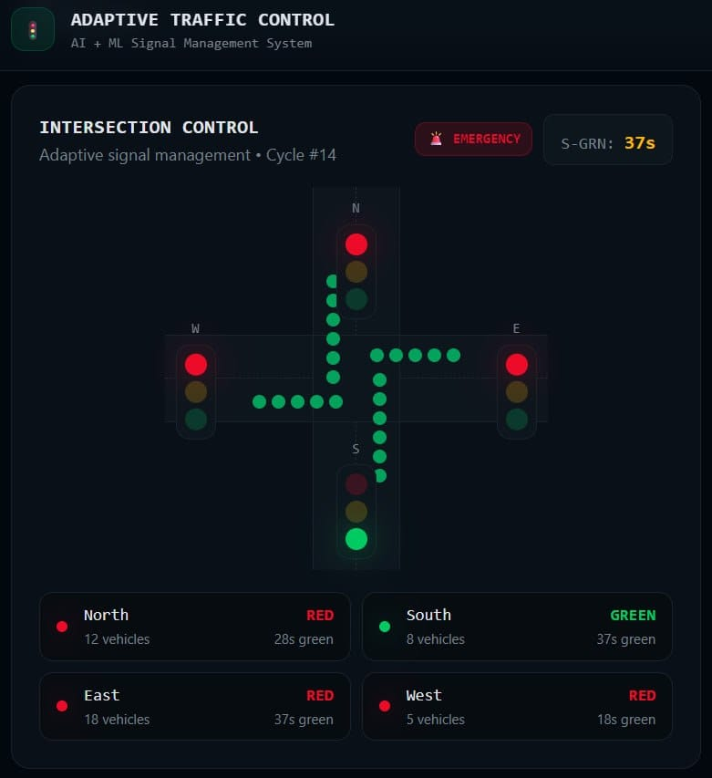
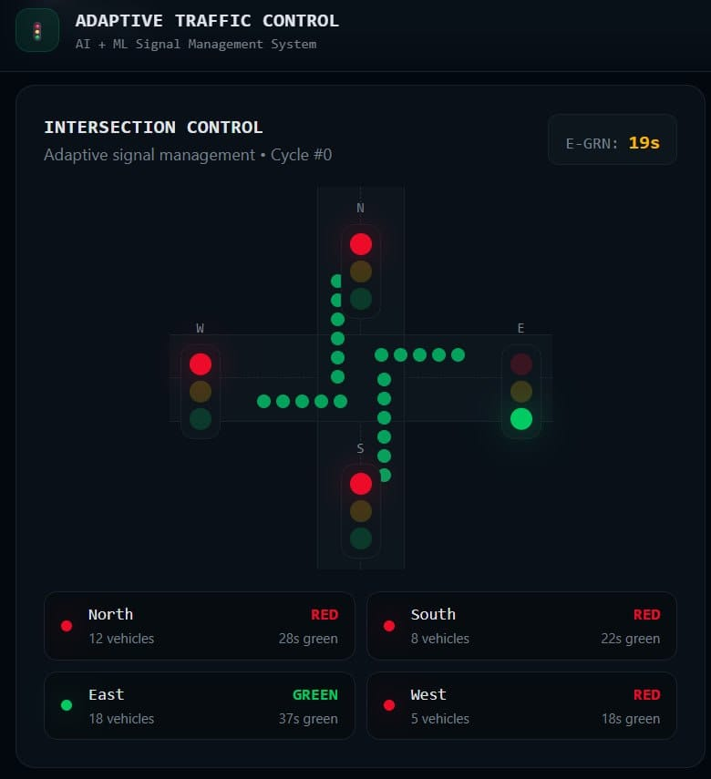
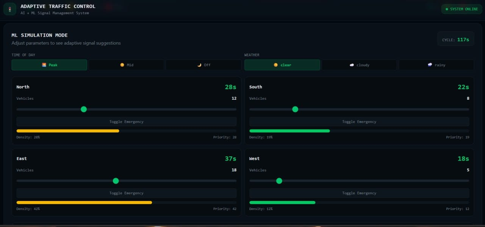
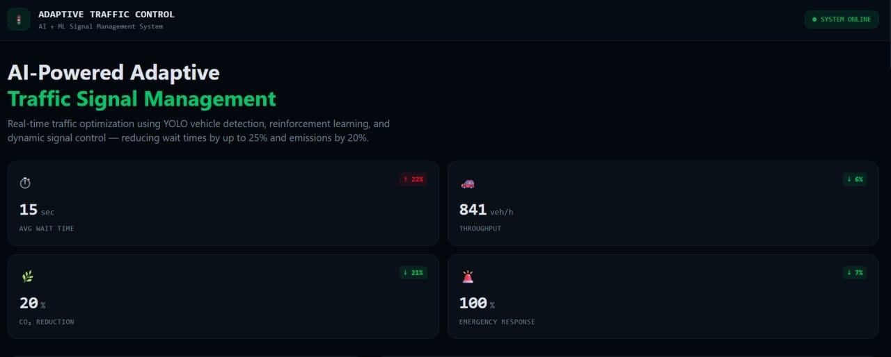
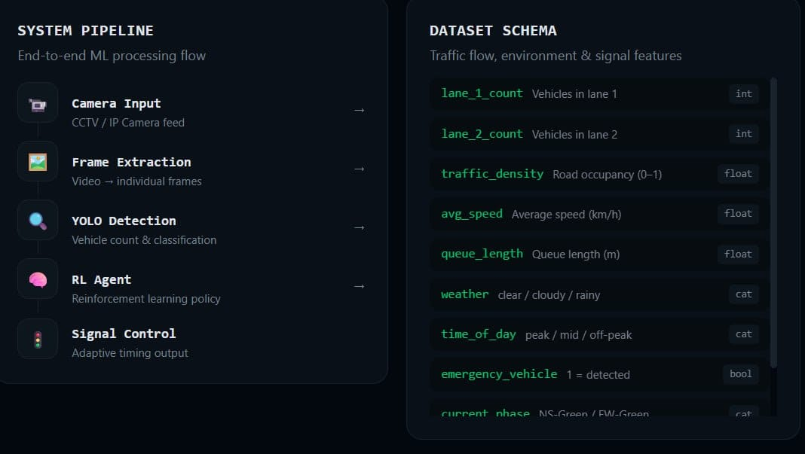

# AI-Powered Adaptive Traffic Signal Management System

A GitHub-ready, responsive traffic dashboard inspired by the supplied UI screenshots.
It demonstrates how traffic density, time of day, weather, and emergency-vehicle priority
can be translated into adaptive signal timing recommendations.

## Highlights

- Dark operations dashboard with KPI cards, intersection signal visualization, cycle timeline, ML recommendation, pipeline, dataset schema, and wait-time comparison.
- Interactive simulation: change traffic volume, time of day, weather, and emergency status.
- Deterministic adaptive optimizer in `ml/signal_optimizer.py`.
- Dependency-free Q-learning example in `ml/train_q_learning.py`.
- Optional YOLO vehicle counting integration in `ml/vehicle_detector.py`.
- Sample traffic data in `data/traffic_sample.csv`.
- No Node.js, React, Tailwind, or database is required for the demo.

## Project structure

```text
adaptive-traffic-control/
├── app.js
├── index.html
├── style.css
├── run.py
├── README.md
├── .gitignore
├── data/
│   └── traffic_sample.csv
├── docs/
│   └── screenshots/
└── ml/
    ├── signal_optimizer.py
    ├── train_q_learning.py
    ├── vehicle_detector.py
    └── requirements-optional.txt
```

## Run locally

### Option 1 — Python (recommended)

Requires Python 3.10+.

```bash
python run.py
```

Open `http://127.0.0.1:8080` in a browser. If port 8080 is busy, use `ATC_PORT=8765 python run.py` and open `http://127.0.0.1:8765`.

### Option 2 — any static server

The frontend is pure HTML/CSS/JS, so this also works:

```bash
python -m http.server 8080
```

Then open `http://127.0.0.1:8080`.

## ML modules

### Adaptive signal optimizer

The optimizer calculates a priority score from vehicle count and traffic density, then adjusts green time using time-of-day and weather modifiers. Emergency vehicles receive priority `100` so the selected approach gets immediate preference.

Run it directly:

```bash
python -m ml.signal_optimizer
```

### Q-learning example

```bash
python ml/train_q_learning.py
```

This writes a small `q_policy.json` file containing a learned policy. It is intended as a transparent educational example rather than a production traffic controller.

### Optional YOLO integration

Install the packages in `ml/requirements-optional.txt` in a compatible Python environment, provide YOLO weights, and call:

```python
from ml.vehicle_detector import detect_vehicles

counts = detect_vehicles("frame.jpg", "yolov8n.pt")
print(counts)
```

## API endpoint

The bundled `run.py` server exposes:

- `GET /api/health` — health check
- `GET /api/recommend` — sample adaptive recommendation from the Python optimizer

The browser UI calculates the same logic locally so it remains usable even without the API.

## Important implementation note

The screenshots provided for this project show a simulated monitoring interface. This repository therefore uses simulated traffic telemetry by default. The YOLO integration is a plug-in point for live or recorded camera frames; no claim is made that the demo is connected to real road infrastructure.

## GitHub upload

From the project directory:

```bash
git init
git add .
git commit -m "Initial adaptive traffic control dashboard"
git branch -M main
git remote add origin https://github.com/<your-username>/adaptive-traffic-control.git
git push -u origin main
```

## Resume description

**AI-Powered Adaptive Traffic Signal Management System** — Built an interactive traffic-control dashboard that models vehicle density, time-of-day, weather, and emergency priority to recommend dynamic signal timings. Implemented a transparent adaptive optimizer, Q-learning training example, and optional YOLO-based vehicle detection integration using Python, JavaScript, HTML, and CSS.

## UI references

The repository includes representative screenshots in `docs/screenshots/` based on the supplied project visuals.










